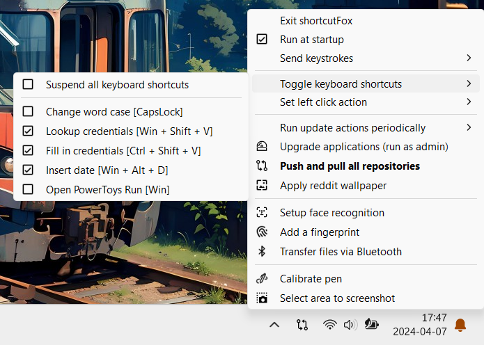

# shortcutFox

[](https://github.com/yetenol/shortcutFox/releases/latest/download/shortcutFox.exe)
[](https://github.com/yetenol/shortcutFox/releases)

shortcutFox is a menu in the system tray that contains frequently used actions , update scripts and settings for keyboard shortcuts. 
With a [human readable configuration file](source/config/trayLayout.ahk) the menu can be edited or additional actions can be added.

# Features



## Keyboard shortcuts

Change **word case** in [editors](#whitelisted-apps-to-toggle-word-case) using `[CapsLock]`

Pop up **KeeWeb**
- Lookup credentials using `[Win + Shift + V]`
- Fill in credentials on websites `[Ctrl + Shift + V]`

Insert the date formatted as YYYY-MM-DD using `[Win + Alt + D]`

## Tray shortcuts

Push and pull and **repositories**
- Finds all repositories
- Pushes and pulls all branches that exist locally and remotely
- Shows progress in a terminal window
- Only fast-forwards the pulls

Upgrade **applications**
- Installs software upgrades via winget
- Shows progress in a terminal window
- Prompts to runs as administrator

Apply reddit **wallpaper**
- Applies image as desktop background
- Downloads best image post from r/wallpaper subreddit
- Stores the image in a Pictures subfolder

Setup face recognition
- Setup Windows Hello (again) to improve face recognition

Add a fingerprint
- Add a fingerprint to Windows Hello

Transfer files via Bluetooth
- Start Bluetooth File Transfer wizard

Recalibrate the **digital pen**
- Useful for convertible laptops

Select area to **screenshot**
- Start Snipping Tool area selection


## Whitelisted apps to toggle word case

- Microsoft **Word**

- Microsoft **PowerPoint**

-  **Files** from [Files Community](https://files.community/)

- Visual Studio **Code**  
  requiring [Change Case](https://marketplace.visualstudio.com/items?itemName=FinnTenzor.change-case)  
  with keybinding `[Shift + F3]` ← Change Word Case

- **Obsidian**   
  requiring [Toggle Case](https://obsidian.md/plugins?id=obsidian-toggle-case)  
  with hotkey `[Shift + F3]` ← Toggle Case: Toggle Case

# Build instructions

- install dependency **AutoHotkey v2**
  by running **[setup](https://www.autohotkey.com/download/ahk-v2.exe)**

- install dependency **ahk2exe Compiler**  
  by extracting the `Compiler` folder from [AutoHotkey v1](https://www.autohotkey.com/download/ahk.zip) _extract Compiler Folder_

- **build an executable** from the project folder  
  by packaging the Powershell script
	```powershell
	$compiler = "$env:ProgramFiles\AutoHotkey 2\Compiler\Ahk2Exe.exe"
	$ahk2 = "$env:ProgramFiles\AutoHotkey 2\AutoHotkey64.exe"
	& $compiler /bin $ahk2 /in source/main.ahk /out bin\shortcutFox.exe
	```

- **start** shortcutFox
  ```powershell
  .\bin\shortcutFox.exe
	```

- enable **run at startup** using  
  `right-click tray icon > Manage script... > Run at startup`  

# Credits

- Icons from [Icons8](https://icons8.com/icons/fluency)
- Converted to ICO using [Convertio](https://convertio.co/png-ico/)
